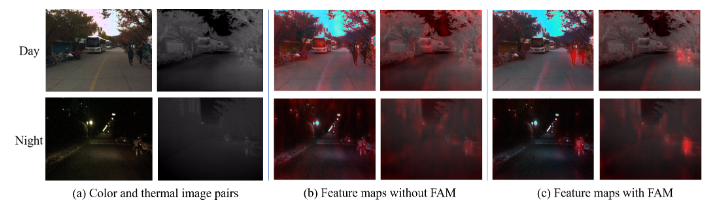
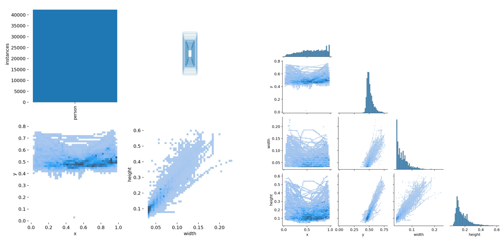
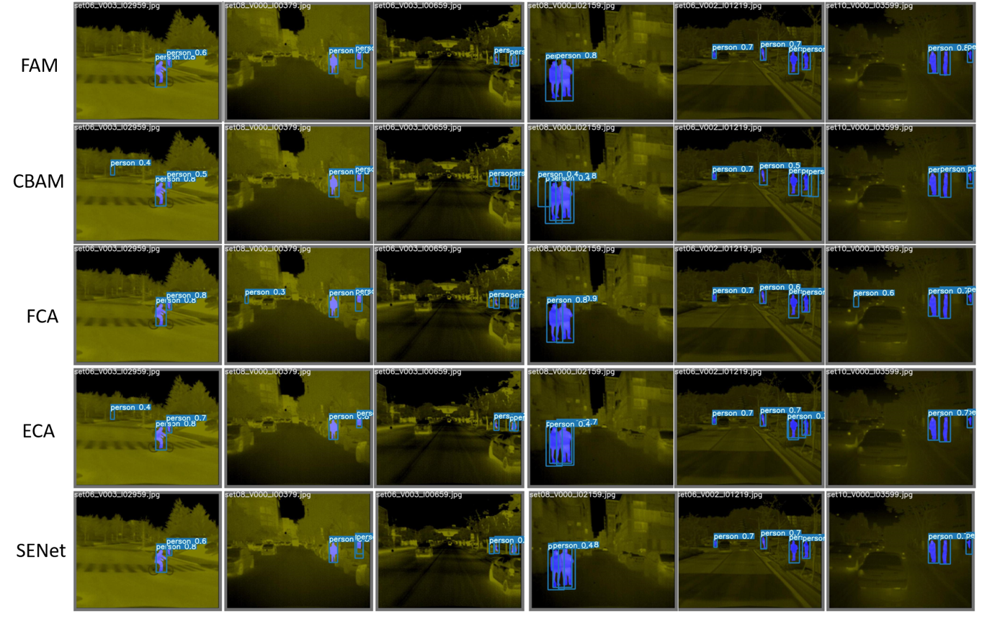
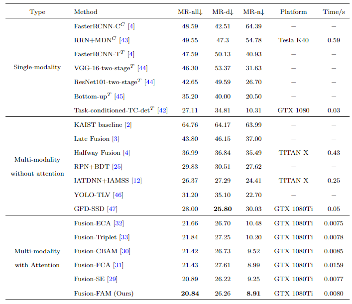
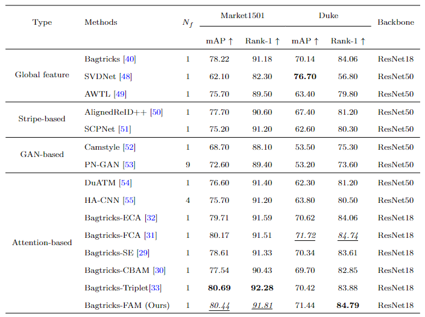

# A Feature Aggregation Network for Multispectral Pedestrian Detection (FANet)



Feature maps generated by our FANet overlapped on the color and thermal images.
(a) represents original color and thermal image pairs, (b) and (c) represent feature maps
without and with FAM, respectively. Redder color represents more intense feature distribution.

Paper is published on Applied Intelligence. [Link](https://link.springer.com/article/10.1007/s10489-023-04628-y)

## Changelog
* [2022-10-23] Release the initial code for FANet.

## 一、Dataset processing
### KAIST dataset
1.  Origin KAIST Dataset: To the best of our knowledge, KAIST is currently the only well-aligned thermal-visible dataset. Please refer to [the official download link.](https://soonminhwang.github.io/rgbt-ped-detection/).
2. Processed KAIST Dataset: Due to the high similarity of the KAIST dataset, current researchers have adopted the data processing scheme of drawing frames and deleting pedestrians in small areas. For ease of use, you can directly refer to the processed dataset published in the  [Task-conditioned Domain Adaptation for Pedestrian Detection in Thermal Imagery](https://drive.google.com/file/d/14A3K2IPPPC8-BwPh-YjeHARaZqjnR655/view).  We normalize and convert to (x, y, w, h) bounding box format, where x and y represent the center of the object, and w and h represent the width and height of the object. Please refer to [Baidu cloud link](https://pan.baidu.com/s/1SLRvgH_eCoiqDhLUVW4OlA?pwd=q4mt).

### CVC-14 Dataset

1. Origin CVC-14 dataset: The dataset is composed by two sets of sequences. These sequences are named as the day and night sets, which refers to the moment of the day they were acquired, and Visible and FIR depending the camera that was user to recor the sequences. Please refer to [Downloading link](http://adas.cvc.uab.es/elektra/enigma-portfolio/cvc-14-visible-fir-day-night-pedestrian-sequence-dataset/).
2. Processed CVC-14 Dataset: We normalize and convert to (x, y, w, h) bounding box format, where x and y represent the center of the object, and w and h represent the width and height of the object. Please refer to [Baidu cloud link](https://pan.baidu.com/s/1SLRvgH_eCoiqDhLUVW4OlA?pwd=q4mt).
Note: In our paper, we do not experiment on cvc-14.    

##  二、Quick Start
### 1. Environment configuration: Clone repo and install requirements.txt in a Python>=3.7.0 environment, including PyTorch>=1.7.
```
git clone https://github.com/gongyan1/FANet
cd FANet
pip install -r requirements.txt  # install
```
### 2. Train
```
# Single-modal (Thermal or RGB)
python train.py --img 640 --batch 16 --epochs 300 --data data/kaist_RGB.yaml --weights weights/yolov5s.pt
python train.py --img 640 --batch 16 --epochs 300 --data data/kaist_thermal.yaml --weights weights/yolov5s.pt

# Multi-modal (Thermal and RGB)
python train_multi.py --img 640 --batch 16 --epochs 300 --data data/kaist_thermal_RGB.yaml --cfg models/yolov5s_gy.yaml
```



### 3.  Test
```
# Single-modal
python test.py --img-size 640 --batch-size 16 --data data/kaist_thermal.yaml --weights weights/yolov5s.pt

# Multi-modal
python test_multi.py  --save-txt  True --task test --img-size 640 --batch-size 16 --data data/kaist_thermal_RGB.yaml --weights runs/train/RGB+thermal2_without_pretrained/weights/best.pt
```



### 4. Result
Comparison of the existing detection methods on the KAIST-Common dataset.
MR-d, MR-n, and MR-all represent the Miss Rate in day, night, and all scenes. Superscript
C or T after the name of a method represents the input is a color or thermal image. ”−”
denotes the corresponding information is not reported in the paper. Bold indicates best
performance.



Comparison of the proposed FAM with existing methods on ReID datasets
Market1501 and Duke. Nf is the number of features used in the inference stage. Bold
indicates best performance; italic with underline represents the second best performance.




